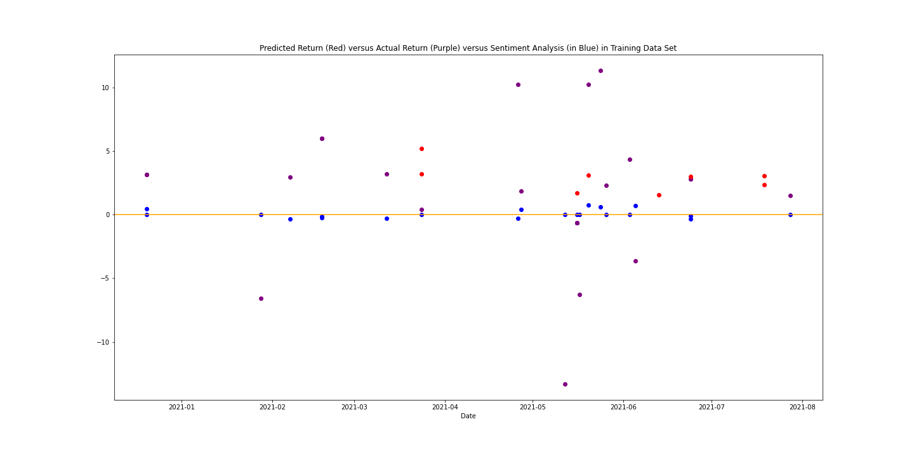

# Team_Project_Moonshot-Twitter_Influence

 With the advent of social media we have seen its influence on opinion and behaviors.  Our goal for this project was to measuer the effect of twitter by major influencers on the price movement of Bitcoin.  Also, we wanted to see if we could predict Bitcoin's price movement based on Sentiment of the Influencer's Tweets.  The time period we chose to study was for a full year between 10-06-2020 and 10-06-2021.

We did extensive research on the Top Crypto Influencers for Bitcoin.

<ul>
    <li>Coin Bureau</li>
    <li>Anthony Pompliano</li>
    <li>Mark Cuban</li>
    <li>Plan B</li>
    <li>Elon Musk</li>
</ul>
<h2>Data Gathering</h2>

We used the popular twitter scraping tool, "Twint", to gather tweets from each influencer's twitter handle.  The most difficult part of the project was gathering the data.  As we were very aware for Machine Learning models, "garbage in, garbage out".  One of the challenges we faced was the Twint tool itself as it required a lot of troubleshooting and returned data inconsistently.  Sometimes it wouldn't work and we would have to run it again.  Also, Twint often would return different amounts of data each time it was ran.  This was especially frustrating for Elon Musk which had almos 2100 tweets for the year and twint ended up creating 55 individual CSVs.

For Bitcoin, we pulled returns from Yahoo using Pandas DataReader.

<h2>Data Preprocessing</h2>

One of the quirks of Twint was that we couldn't filter the tweets based on subject.  So we had to either use an advanced search from Twitter wtihin Twint or filter our data once it was pulled.  Once our data was collected we had to combine multiple CSV files to create a single DataFrame for Twitter data.  Once completed we also had to reduce our data to only the necessary features.

From Yahoo we pulled BTC-USD history for the year timeframe and calculated the returns and the 1 day lagged return.  Once completed, we joined the 1 day lagged return to our Twitter data.  The 1 day lagged return is important as it is our Target for training and prediction.

<h2>Sentiment Analysis</h2>

Another feature we had to create was the Sentiment Analysis score for each tweet.  We chose to use the Vader compound score as it is a concise and simple score that can be used as a single feature for our training.  For the Vader Compound Score 1 equals 100% positive, 0 is neutral, and -1 is 100% negative.

<h2>Feature Selection and Engineering</h2>

The features we chose to use were 'retweet count', 'likes count', 'replies count', and compound sentiment analysis of each tweet.  The target we were trying to predict from this was the next day's return after each tweet.

For feature scaling we used Min/Max Scaler as a part of Pipeline class from SciKitLearn.

<h2>Fitting the Model to the Data</h2>

We used Linear Regression and Stochastic Gradient Regression algorithms as our estimator.

We chose Linear Regression because our Features and Targets were all linear values and thought this would be a good fit.

We chose Stochastic Gradient Regression (SGD) as it is considered a good model for capturing outliers in the data.

<h2>Model Outcome</h2>

We used R^2 and Mean Absolute Error for measuring the performance of both models.

R^2 can have a maximum value of 1. The higher the value, the better the prediction.

Mean Absolute Error shows the difference between the actual and the predicted.

Our outcomes were as follows:

<ul>
    <li>Coin Bureau</li>
        

            Mean Absolute Error for Linear Regression, coin_bureau:  3.3380611018284925 
            Score for Linear Regression, coin_bureau 0.043975937202313076 
            Mean Absolute Error for SGD Regression, coin_bureau:  3.3745641385659884 
            Score for SGD Regression, coin_bureau 0.0096320156301134 
        

    <li>Anthony Pompliano</li>
        

            Mean Absolute Error for Linear Regression, A_Pomp:  3.427330562261765 
            Score for Linear Regression A_Pomp -0.5725208614420101 
            Mean Absolute Error for SGD Regression, A_Pomp:  3.429356523320292 
            Score for SGD Regression, A_Pomp -0.12759575605369045 
        

    <li>Mark Cuban</li>
        

    <li>Plan B</li>
        

    <li>Elon Musk: 
        

            Mean Absolute Error for Linear Regression:  3.823544002088014 
            R^2 Score for Linear Regression -0.15247038945928892 
            Mean Absolute Error for SGD Regression:  3.8222414070804835 
            R^2 Score for SGD Regression 0.09334151220648967 
            
        

    </li>
    <li>Bitboy and Vitalik</li>
        

            Mean Absolute Error for Linear Regression:  2.480915499754723
            Score for Linear Regression -0.5976024639056632
            Mean Absolute Error for SGD Regression:  2.6159054255969934
            Score for SGD Regression -0.6236900686111211
        

</ul>

<h2>Conclusion</h2>

Although people often credit influencers for price movement, our results did not show strong impact on the BTC-USD price from their tweets.
